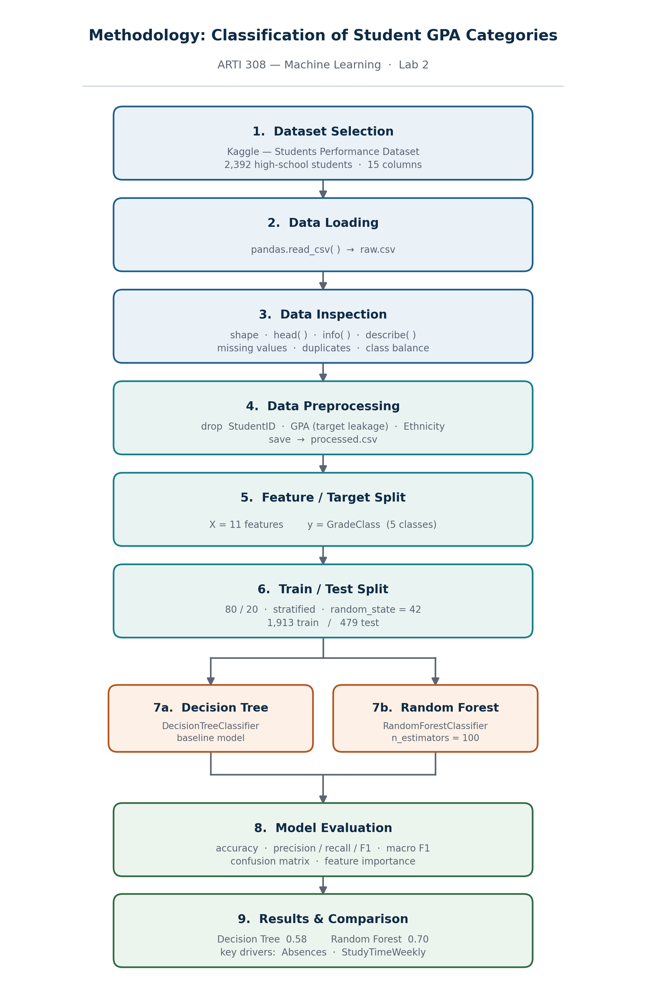

# Machine Learning-Based Classification of Student GPA Categories

**ARTI 308 — Machine Learning · Lab 2**

A supervised classification project that predicts a student's grade category (`GradeClass`) from demographic, academic, and extracurricular features. Two tree-based models are trained and compared: a Decision Tree and a Random Forest.

---

## 1. Problem Definition

**Problem statement.** High schools often identify struggling students only after final grades are released, which is too late for intervention. The aim of this project is to predict which grade category a student will fall into, using information that a school already holds during the term — attendance, weekly study time, parental involvement, tutoring, and participation in extracurricular activities. A working model would let a school flag at-risk students early enough to act.

| Question | Answer |
|---|---|
| Is there a target variable? | Yes — `GradeClass` |
| Problem type | **Classification** (multi-class, 5 ordered categories) |
| What the model learns | The relationship between a student's study habits, attendance, and family background and the grade band they end up in |
| What it predicts | One of 5 grade categories for a student it has not seen before |

The target is discrete and labelled, so this is supervised classification rather than regression (the value predicted is a category, not a number) or clustering (the labels are known in advance).

## 2. Dataset

Source: **Students Performance Dataset** — Kaggle
<https://www.kaggle.com/datasets/rabieelkharoua/students-performance-dataset>

| | |
|---|---|
| Rows | 2,392 high-school students (ages 15–18) |
| Columns (raw) | 15 |
| Features used | 11 |
| Missing values | 0 |
| Duplicate rows | 0 |
| Raw file | `data/raw.csv` |
| Cleaned file | `data/processed.csv` |

### Columns

| Column | Type | Description |
|---|---|---|
| `StudentID` | int | Unique identifier (dropped) |
| `Age` | int | 15–18 |
| `Gender` | int | 0 = Male, 1 = Female |
| `Ethnicity` | int | 0 = Caucasian, 1 = African American, 2 = Asian, 3 = Other (dropped) |
| `ParentalEducation` | int | 0 = None, 1 = High School, 2 = Some College, 3 = Bachelor's, 4 = Higher |
| `StudyTimeWeekly` | float | Hours per week, 0–20 |
| `Absences` | int | 0–29 |
| `Tutoring` | int | 0 = No, 1 = Yes |
| `ParentalSupport` | int | 0 = None, 1 = Low, 2 = Moderate, 3 = High, 4 = Very High |
| `Extracurricular` | int | 0 = No, 1 = Yes |
| `Sports` | int | 0 = No, 1 = Yes |
| `Music` | int | 0 = No, 1 = Yes |
| `Volunteering` | int | 0 = No, 1 = Yes |
| `GPA` | float | 0.0–4.0 (dropped — see below) |
| `GradeClass` | float | **Target**, 5 ordered categories (0–4) |

### Target distribution

| Class | Count | Share |
|---|---|---|
| 4.0 | 1,211 | 50.6% |
| 3.0 | 414 | 17.3% |
| 2.0 | 391 | 16.3% |
| 1.0 | 269 | 11.2% |
| 0.0 | 107 | 4.5% |

The target is heavily imbalanced — class 4 alone is half the data. This matters when reading the results below: a model that predicted class 4 for everything would already score about 51% accuracy.

Per the source documentation, `GradeClass` bands GPA into letter grades, with 0 as the highest band and 4 as the lowest.

## 3. Methodology Diagram



The diagram is also available as [`methodology_diagram.pdf`](methodology_diagram.pdf).

> **AI disclosure:** this methodology diagram was generated with the assistance of an AI tool.

## 4. Preprocessing

Three columns are dropped:

- **`StudentID`** — an identifier with no predictive signal.
- **`GPA`** — `GradeClass` is derived directly from GPA, so keeping it would leak the answer and push accuracy near 100% for the wrong reason.
- **`Ethnicity`** — removed from the feature set.

No imputation, scaling, or encoding is needed: there are no nulls or duplicates, and every remaining column is already numeric. Tree-based models don't require feature scaling.

## 5. Method

1. Split features `X` (11 columns) from target `y` (`GradeClass`).
2. `train_test_split` with `test_size=0.2`, `random_state=42`, `stratify=y` → 1,913 train / 479 test. Stratifying keeps the class proportions intact in both splits, which matters given the imbalance.
3. Fit `DecisionTreeClassifier(random_state=42)` — default depth, so it grows until leaves are pure.
4. Fit `RandomForestClassifier(n_estimators=100, random_state=42)`.
5. Evaluate both with accuracy, a per-class classification report, and a confusion matrix heatmap.

## 6. Results

| Model | Accuracy |
|---|---|
| Decision Tree | 0.580 |
| **Random Forest** | **0.704** |

The Random Forest gains about 12 percentage points. The unconstrained Decision Tree overfits the training data; averaging 100 trees reduces that variance.

### Decision Tree — per class

| Class | Precision | Recall | F1 | Support |
|---|---|---|---|---|
| 0.0 | 0.22 | 0.19 | 0.21 | 21 |
| 1.0 | 0.33 | 0.43 | 0.37 | 54 |
| 2.0 | 0.39 | 0.36 | 0.37 | 78 |
| 3.0 | 0.34 | 0.39 | 0.36 | 83 |
| 4.0 | 0.85 | 0.79 | 0.82 | 243 |
| **Macro avg** | 0.43 | 0.43 | 0.43 | 479 |
| **Weighted avg** | 0.60 | 0.58 | 0.59 | 479 |

### Random Forest — per class

| Class | Precision | Recall | F1 | Support |
|---|---|---|---|---|
| 0.0 | 0.38 | 0.14 | 0.21 | 21 |
| 1.0 | 0.51 | 0.48 | 0.50 | 54 |
| 2.0 | 0.51 | 0.60 | 0.55 | 78 |
| 3.0 | 0.48 | 0.48 | 0.48 | 83 |
| 4.0 | 0.90 | 0.91 | 0.91 | 243 |
| **Macro avg** | 0.56 | 0.52 | 0.53 | 479 |
| **Weighted avg** | 0.70 | 0.70 | 0.70 | 479 |

Both models do well on class 4 and poorly on class 0, which has only 21 test samples. The Random Forest's headline accuracy improves, but its recall on class 0 actually drops to 0.14 — it recovers just 3 of 21 top students. Macro F1 (0.53) is a more honest summary of overall performance here than accuracy (0.70).

### Feature importance (Random Forest)

| Feature | Importance |
|---|---|
| Absences | 0.457 |
| StudyTimeWeekly | 0.188 |
| ParentalSupport | 0.073 |
| ParentalEducation | 0.062 |
| Age | 0.061 |
| Gender | 0.030 |
| Sports | 0.029 |
| Extracurricular | 0.027 |
| Tutoring | 0.027 |
| Music | 0.024 |
| Volunteering | 0.021 |

Absences and weekly study time account for roughly 65% of total importance — behaviour the school can observe and influence matters more here than family background. The binary activity flags contribute very little individually. Note that impurity-based importance tends to favour continuous and high-cardinality features, so `Absences` and `StudyTimeWeekly` have a structural advantage over the 0/1 columns; permutation importance would give a fairer read.

## 7. Requirements

```
pandas
scikit-learn
matplotlib
seaborn
```

Install with:

```bash
pip install pandas scikit-learn matplotlib seaborn
```

## 8. Repository structure

```
.
├── README.md
├── methodology_diagram.png
├── methodology_diagram.pdf
├── data/
│   ├── raw.csv           # original dataset
│   └── processed.csv     # after dropping StudentID, GPA, Ethnicity
└── notebooks/
    └── GPA_Classification.ipynb
```

Paths in the notebook are relative (`../data/raw.csv`), so it expects to be run from the `notebooks/` directory.

## 9. Usage

```bash
jupyter notebook notebooks/GPA_Classification.ipynb
```

Run the cells top to bottom. `random_state=42` is set on the split and both models, so results are reproducible.

## 10. Possible next steps

- **Handle the imbalance** — `class_weight="balanced"` or resampling, to improve recall on the minority classes.
- **Tune hyperparameters** — `max_depth` and `min_samples_leaf` on the Decision Tree would curb the overfitting; `GridSearchCV` or `RandomizedSearchCV` on the Random Forest.
- **Cross-validate** — a single 80/20 split on 2,392 rows gives a noisy estimate, especially for class 0 with 21 test samples. `StratifiedKFold` would be more reliable.
- **Report macro F1 alongside accuracy** so minority-class performance isn't hidden.
- **Try other models** — gradient boosting (XGBoost, LightGBM) usually beats a plain Random Forest on tabular data of this shape.
- **Reconsider ordinality** — `GradeClass` is ordered, so misclassifying an A as a B is less wrong than as an F. An ordinal model, or regression on GPA followed by binning, might suit the problem better.
